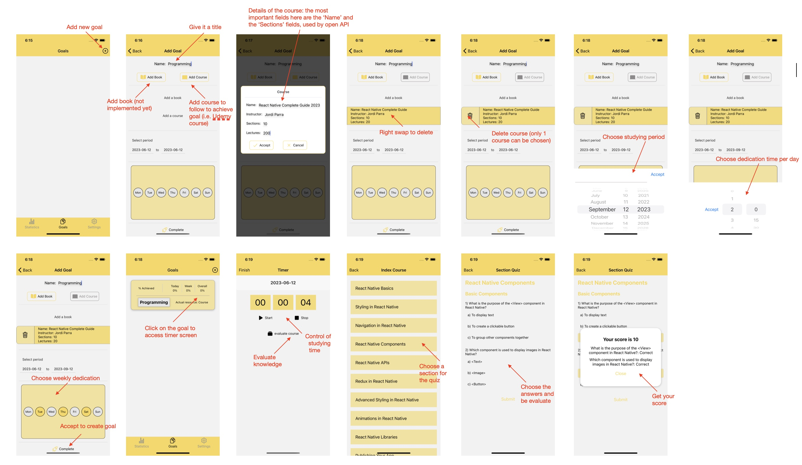

# s2e (Study To Evolve)

## Description

React Native 's2e' (StudyToEvolve) is a mobile application that seeks to optimize personal learning and study habits. This app features an intuitive user interface with a focus on goal-setting and tracking to aid users in managing their educational journey more effectively.

The application is built around three main sections: Statistics, Goals, and Settings. Currently, the Goals section is functional and it is designed to help users create, manage, and track their study objectives. Users can add course-based goals and utilize an interactive timer feature to monitor their daily study habits. A unique feature of this application is its ability to generate interactive quizzes that offer a self-assessment tool based on the course information provided.
As it stands, 's2e' is in its initial development stages. Exciting features and improvements are planned for future updates, making the study process even more engaging and productive for users.

Please refer to the Usage section for more detailed information on how to navigate the application.

## Table of Contents

- [Installation](#installation)
    - [Prerequisites](#prerequisites)
    - [Backend Setup](#backend-setup)
    - [Installing](#installing)- [Usage](#usage)
- [Technologies](#technologies)
- [Usage](#usage)
- [Contact](#contact)

## Installation

### Prerequisites

Ensure that you have the following installed on your local development machine:

1. **Node.js**: Visit the [official Node.js website](https://nodejs.org/) to download and install Node.js. This will include `npm`, the Node.js package manager.

    ```
    # To check your version of Node.js and npm
    node -v
    npm -v
    ```

2. **Yarn**: Yarn is another JavaScript package manager that can be used alongside or as an alternative to npm. Visit the [official Yarn website](https://yarnpkg.com/) to download and install Yarn.

    ```
    # To check your version of yarn
    yarn -v
    ```

3. **Xcode**: If you're on macOS, you'll need Xcode for iOS development (and an Apple developer account). You can install Xcode from the [Mac App Store](https://apps.apple.com/us/app/xcode/id497799835).

### Backend setup

This project relies on backend services that are deployed to AWS using Serverless Framework. These services interact with OpenAI API to fetch course indexes and quiz data. 

To setup and deploy these services, please follow the instructions in the [s2e-backend repository](https://github.com/jparraporcar/s2e-backend).

Once the backend is deployed, you need to create a new file .env in the root of the app with the two endpoints coming from the backend:

```
INDEX_API_URL=xxx
SECTION_API_URL=xxx
```

### Installing

1. **Clone the repo**: Clone this repository to your local machine.

    ```
    git clone https://github.com/jparraporcar/s2e.git
    ```

2. **Navigate to the cloned directory**: Use the command line to navigate into the directory you just cloned.

    ```
    cd s2e
    ```

3. **Install npm packages**: Run `npm install` to install all the dependencies defined in the package.json file.

    ```
    npm install
    ```

4. **Install Yarn packages**: Run `yarn install` to install all the dependencies defined in the package.json file.

    ```
    yarn install
    ```

5. **Start Metro Bundler**: In a new terminal window, run `npx react-native start` to start Metro Bundler.

    ```
    npx react-native start
    ```

6. **Start the iOS application**: In a different terminal window, run `npx react-native run-ios` to start the iOS application. The simulator should start automatically once the build is complete.

    ```
    npx react-native run-ios
    ```

## Usage

<figure>
  <figcaption>App flow</figcaption>
  <br />
  <br />
  
</figure>

## Contact

If you want to contact me you can reach me at:

- **Name**: `Jordi Parra Porcar`
- **Email**: `jordiparraporcar@gmail.com`
- **LinkedIn**: [`Jordi Parra Porcar`](https://www.linkedin.com/in/jordiparraporcar/)


